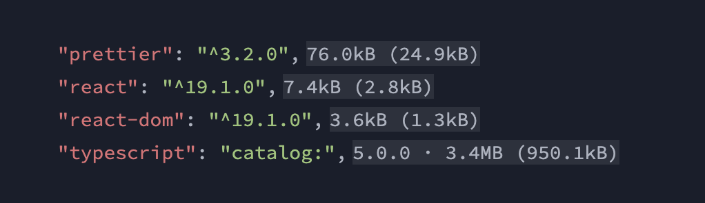

# 📦😱 Bundlephobic

Show the size of your packages from [bundlephobia.com](https://bundlephobia.com/) directly in `package.json`.

## What this extension does

When you open `package.json`, the extension will show the size of your packages near the name of the package.
